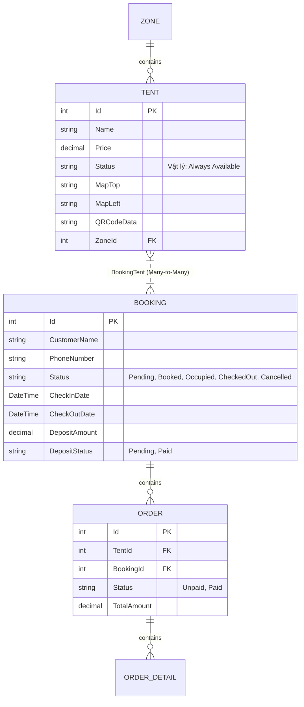
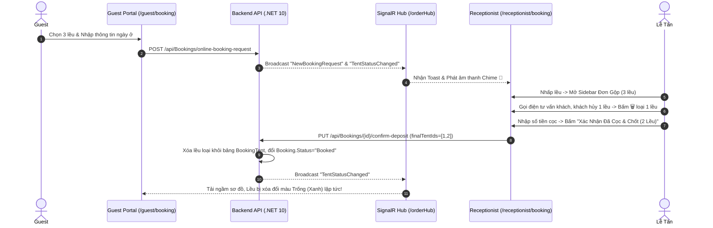

# 🏔️ BÙI HUI CAMPING - SYSTEM ARCHITECTURE & FEATURE DOCUMENTATION

Document này tổng hợp chi tiết toàn bộ kiến trúc hệ thống, luồng nghiệp vụ, công thức tính toán và quy tắc lập trình của dự án **Bùi Hui Camping**.

---

## 🛠️ 1. Công Nghệ & Kiến Trúc Hệ Thống (Tech Stack)

### Backend (`/BE`):
- **Framework**: ASP.NET Core 10.0 Web API
- **ORM & Database**: Entity Framework Core + SQL Server (`AppDbContext`)
- **Real-time Communication**: SignalR WebSocket Hub (`/orderHub`)
- **CORS & Credentials**: Cấu hình `AllowCredentials()` cho phép truyền Cookie/Token giữa FE & BE.

### Frontend (`/FE`):
- **Framework**: React 18 (Vite)
- **Styling & UI**: Vanilla CSS + TailwindCSS + Lucide Icons
- **Real-time Service**: Custom Persistent SignalR Service (`FE/src/services/signalrService.js`)
- **Toast Notifications**: React Hot Toast (`react-hot-toast`)

---

## 🗄️ 2. Mô Hình Dữ Liệu Core (Entities & Database Schema)



### ⚠️ Quy Tắc Vàng Về Trạng Thái Lều (`Tent.Status` vs `Booking.Status`):
- **Cột `Status` trên bảng `Tents` trong SQL Server**: Luôn giữ ở trạng thái vật lý mặc định là `"Available"` (Trống/Hoạt động bình thường). **KHÔNG LƯỢC** ghi đè trạng thái `"Booked"` hay `"Occupied"` trực tiếp lên dòng `Tent` trong CSDL.
- **Trạng thái thực tế theo ngày (`Date-Effective Status`)**: Được tính toán động hoàn toàn dựa trên sự tồn tại của các `Booking` có trạng thái hoạt động (`Pending`, `Booked`, `Occupied`) trùng lịch lưu trú.

---

## 📅 3. Thuật Toán Lọc Trạng Thái Lều Theo Ngày & Giờ Linh Hoạt (Ở Qua Đêm vs Ở Trong Ngày / Theo Giờ)

### 📌 2 Loại Hình Đặt Lều Được Hỗ Trợ:
1. **🌙 Ở Qua Đêm (Overnight - Resort Standard)**:
   - Check-in mặc định: **14:00 (14h chiều)**.
   - Check-out mặc định: **12:00 (12h trưa ngày hôm sau)**.
2. **☀️ Ở Trong Ngày / Theo Giờ (Day-Use / Flexible Hours)**:
   - Cho phép khách/lễ tân chọn linh hoạt **Giờ Check-in** (VD: `14:00`, `08:00`) và **Giờ Check-out** (VD: `20:00`, `12:00`).

### 📐 Công Thức Toán Học Kiểm Tra Trùng Lịch Thời Gian Thực (Timestamp-Precision Overlap):
CSDL lưu trữ mốc thời gian dạng `DateTime` tiêu chuẩn (Bao gồm Ngày + Giờ + Phút).
Một `Booking` có khoảng thời gian `[bIn, bOut]` trùng với khoảng thời gian tìm kiếm `[targetIn, targetOut]` khi và chỉ khi:

$$\text{Overlapping} = (\text{bIn} < \text{targetOut}) \land (\text{bOut} > \text{targetIn})$$

#### Ví Dụ 1: Giải Quyết Bài Toán Đặt Nối Tiếp Chiều Hôm Sau
- **Khách 1 ở qua đêm**: `01/08 14:00 ➔ 02/08 12:00`
- **Khách 2 đặt nối tiếp**: `02/08 14:00 ➔ 03/08 12:00`
- **Kết quả quét**: $\text{bOut} > \text{targetIn} \implies (02/08\text{ 12:00} > 02/08\text{ 14:00}) \implies \mathbf{FALSE}!$
- 👉 **Lều TRỐNG cho Khách 2 đặt nối tiếp từ 14h ngày 02/08!**

#### Ví Dụ 2: Giải Quyết Bài Toán Đặt Trong Ngày Bị Trùng Lịch (User Case)
- **Khách 1 ở qua đêm**: `01/08 14:00 ➔ 02/08 12:00`
- **Khách 2 tìm đặt trong ngày**: `01/08 14:00 ➔ 01/08 20:00`
- **Kết quả quét**:
  $$\text{bIn} < \text{targetOut} \implies (01/08\text{ 14:00} < 01/08\text{ 20:00}) \implies \mathbf{TRUE}$$
  $$\text{bOut} > \text{targetIn} \implies (02/08\text{ 12:00} > 01/08\text{ 14:00}) \implies \mathbf{TRUE}$$
- 👉 **Kết quả: $\mathbf{TRUE \land TRUE = TRUE} \implies$ Lều BỊ KHÓA (BLOCK) cho khung 14h-20h ngày 1/8!**

### 💻 Mã Nguồn Chuẩn Lọc Theo Mốc Thời Gian Thực & Chuẩn Hóa Dữ Liệu Cũ (FE):
```javascript
// Chuẩn hóa dữ liệu cũ (Legacy Fallback nếu DB lưu 00:00:00)
let bIn = new Date(b.checkInDate);
let bOut = new Date(b.checkOutDate);

if (bIn.getHours() === 0 && bIn.getMinutes() === 0) {
  const datePart = typeof b.checkInDate === 'string' ? b.checkInDate.split('T')[0] : bIn.toISOString().split('T')[0];
  bIn = new Date(`${datePart}T14:00:00`);
}
if (bOut.getHours() === 0 && bOut.getMinutes() === 0) {
  const datePart = typeof b.checkOutDate === 'string' ? b.checkOutDate.split('T')[0] : bOut.toISOString().split('T')[0];
  bOut = new Date(`${datePart}T12:00:00`);
}

// Mốc thời gian tìm kiếm từ bộ chọn 24H (00:00 -> 23:30)
const targetIn = new Date(`${checkInDate}T${checkInTime}:00`);
const targetOut = new Date(`${checkOutDate}T${checkOutTime}:00`);

// Exact overlap calculation
const isOverlapping = bIn < targetOut && bOut > targetIn;
```

---

## 📦 4. Nghiệp Vụ Quản Lý Đơn Đặt Lều Gộp / Đơn Lẻ (Multi-Tent Booking & Deposit Workflow)



### 📋 Giao Diện Sidebar Lễ Tân (`ReceptionistBookingPage.jsx`):
- **Phân loại thẻ đơn**:
  - `📦 ĐƠN ĐẶT GỘP (X LỀU)`: Đơn khách đặt nhiều lều cùng lúc.
  - `👤 ĐƠN ĐẶT LẺ (1 LỀU)`: Đơn khách đặt 1 lều duy nhất.
- **Tính toán tiền**:
  - Tự động cộng tổng tiền thuê lều per night.
  - Gợi ý mức tiền cọc 30% - 50% cho lễ tân tư vấn.
- **Xóa bớt lều trong đơn gộp**: Nút `Trash2` hỗ trợ loại bỏ lều khách không chọn trước khi chốt cọc.

---

## ⚡ 5. Kiến Trúc SignalR Real-time (`signalrService.js`)

- **Persistent Listener Registry**: Quản lý sự kiện qua `Map<string, Set<Function>>`.
- **Auto Re-bind on Reconnect**: Khi SignalR ngắt kết nối hoặc khôi phục mạng, tất cả sự kiện `TentStatusChanged` và `NewBookingRequest` tự động được đăng ký lại.
- **Silent Background Refresh**: FE gọi `fetchData(false)` để cập nhật dữ liệu ngầm mà không làm trắng màn hình hoặc bật spinner giật lag.

---

## 🛡️ 6. Quy Tắc Validate Ô Chọn Ngày (Check-in / Check-out)

| Trang | Thuộc tính Check-in | Thuộc tính Check-out | Quy tắc tự động |
| :--- | :--- | :--- | :--- |
| **Guest** (`/guest/booking`) | `min={today}` (Khóa ngày quá hạn) | `min={checkInDate}` | Nếu `CheckIn > CheckOut` ➔ Tự động đẩy `CheckOut = CheckIn + 1 ngày`. |
| **Receptionist** (`/receptionist/booking`) | Tự do chọn ngày quá khứ/tương lai | `min={filterCheckIn}` | Báo lỗi Toast nếu `CheckOut < CheckIn` và tự đưa về bằng `CheckIn`. |

---

## 🚀 7. Danh Sách Endpoint API Chi Tiết

- `GET /api/Zones`: Tải tất cả Khu vực kèm Lều & Bookings.
- `GET /api/Tents`: Tải tất cả Lều kèm Zone & Bookings (`AsNoTracking()`).
- `POST /api/Bookings/online-booking-request`: Khách gửi yêu cầu đặt lều.
- `PUT /api/Bookings/{id}/confirm-deposit`: Lễ tân chốt cọc & cập nhật danh sách lều chốt cuối.
- `PUT /api/Bookings/{id}/reject-request`: Lễ tân hủy/từ chối đơn.
- `PUT /api/Bookings/{id}/checkin`: Chuyển đơn sang `Occupied` và tạo Master Order tiền lều.
- `PUT /api/Bookings/{id}/checkout`: Thanh toán toàn bộ Order & trả lều.
- `GET /api/Bookings/reset-tent-statuses`: Reset toàn bộ trạng thái lều vật lý trong CSDL về `Available`.

---
*Dữ liệu được cập nhật ngày 28/07/2026 bởi Antigravity AI Agent.*
